# DCSS Frontend References

이 디렉터리는 프론트엔드 디자인 구현 때 참고할 실제 DCSS 화면 자료입니다.
자료 출처는 DCInside 로그라이크 갤러리로 제한합니다.

현재 React 구현 결과 스크린샷은 reference가 아니므로 `frontend/screenshots/current-ui/`에 따로 둡니다.

## Primary Item Descriptions

아이템 상세 패널 구현은 아래 이미지를 우선 기준으로 삼습니다.

1. 아티팩트 장갑 설명창

   왼쪽 타일, 제목 한 줄, 설명 본문, 속성 설명 표, 장착 수치 변화, 획득 위치, stash/search prefix까지 포함한 핵심 reference입니다.

   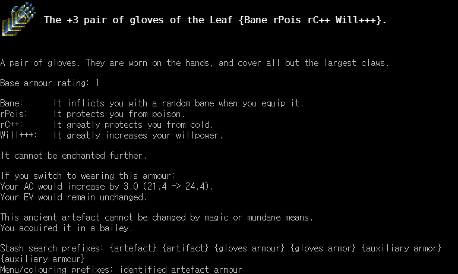

2. 대형 방어구 설명창

   넓은 설명창, 긴 제목, 하단 액션 키, 고유 flavour text까지 포함합니다.

   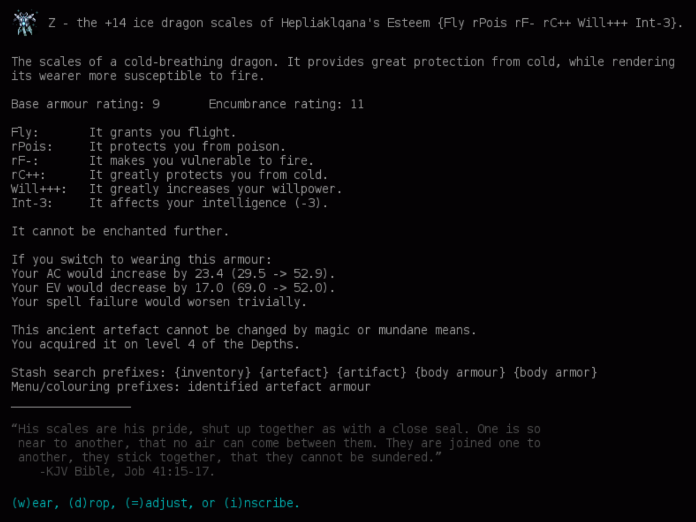

3. 착용 중 방어구 설명창

   착용 중 상태, `take off` 액션, 얇은 테두리와 패널 폭을 확인합니다.

   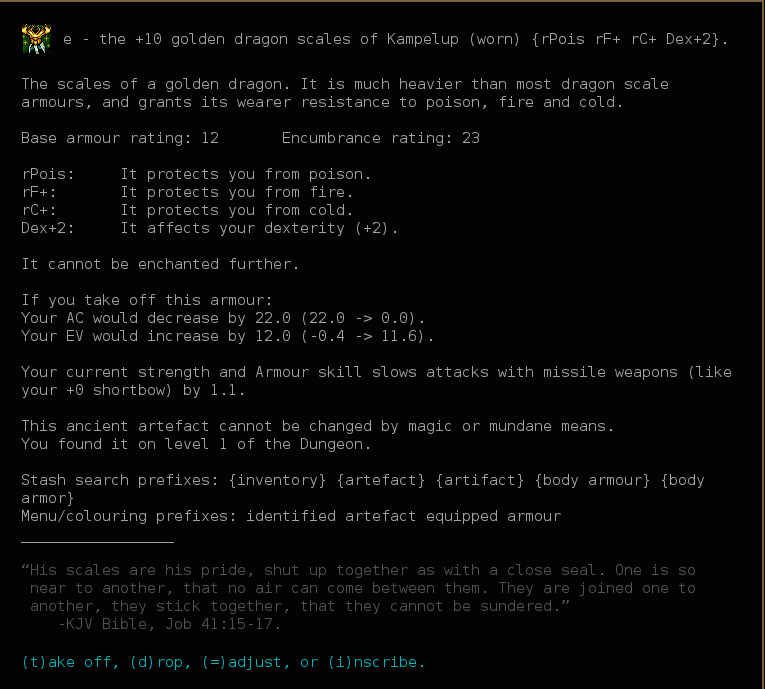

4. 긴 설명과 스크롤바

   긴 flavour text와 오른쪽 스크롤바가 있는 아이템 설명창입니다.

   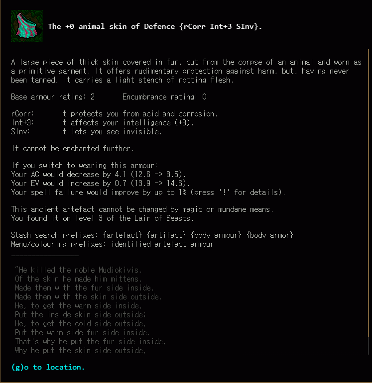

5. 짧은 장갑 설명창

   짧은 설명창에서 타일, 제목, 본문, 속성 표가 얼마나 압축되는지 확인합니다.

   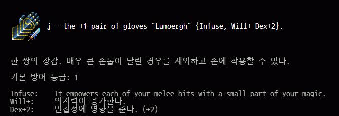

6. 착용 중 짧은 장갑 설명창

   짧은 설명창의 착용 상태와 제목 줄 구성을 확인합니다.

   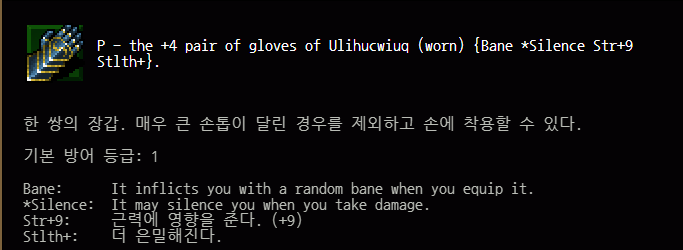

7. 영어 장신구 설명창

   현재 프론트엔드의 영어 artifact 설명과 가장 직접적으로 비교할 ring reference입니다.

   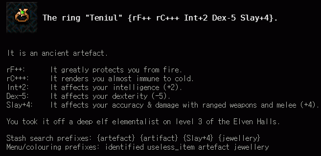

8. 한글 장신구 설명창

   장신구의 타일, 제목, 속성 설명, 착용 시 변화가 큰 글자 환경에서 어떻게 보이는지 확인합니다.

   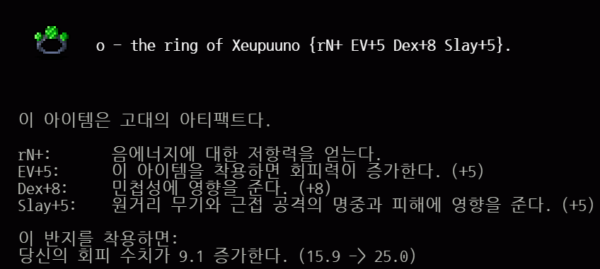

## Lists, Menus, And Rows

갤러리 리스트, 카드, 필터 결과, 모바일 행 밀도를 조정할 때 참고합니다.

1. 모바일/확대 아이템 한 줄

   긴 randart 이름과 속성 목록이 한 줄에서 어떻게 보이는지 확인합니다.

   

2. 장비 목록

   장비 카테고리, 착용 상태, 타일, 문자 hotkey, 아이템명, 속성 목록의 간격을 확인합니다.

   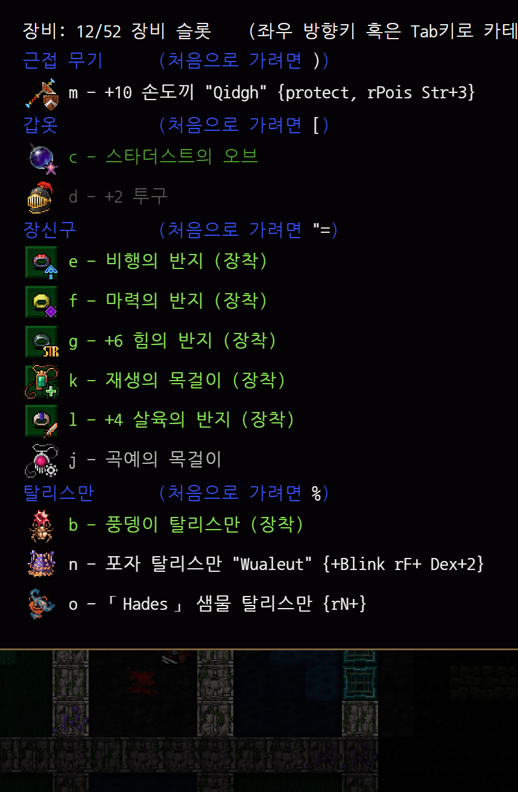

3. 상점 아이템 목록

   가격, hotkey, 아이콘, 이름, 속성 목록, 선택 행 highlight의 밀도를 확인합니다.

   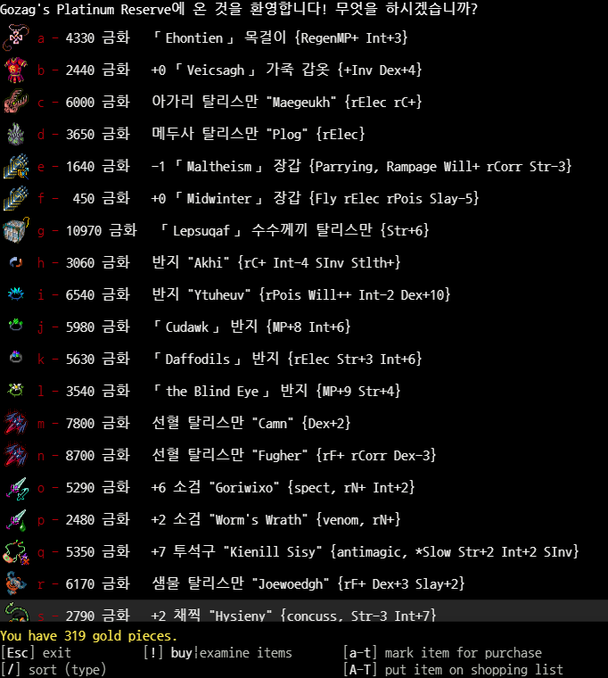

4. Acquirement 아이템 메뉴

   팝업 테두리, 선택 행 highlight, 메뉴 하단 명령줄을 확인합니다.

   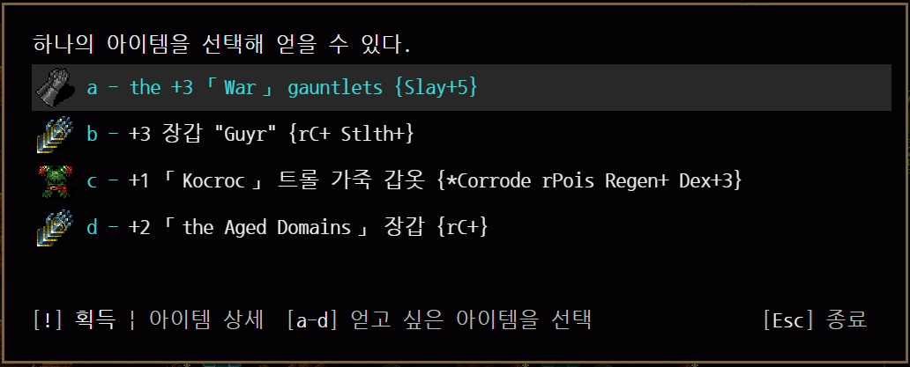

5. 메시지 로그의 artifact 링크

   하단 로그에서 artifact 이름이 색상 링크처럼 표시되는 방식을 확인합니다.

   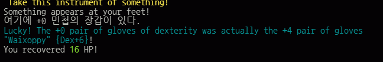

## WebTiles Shell

전체 화면 구성, 우측 상태 패널, 팝업 overlay, 검은 여백, 지도/메시지 밀도를 조정할 때 참고합니다.

1. 현재 WebTiles 플레이 화면

   브라우저에서 실행 중인 현재 WebTiles 화면입니다.

   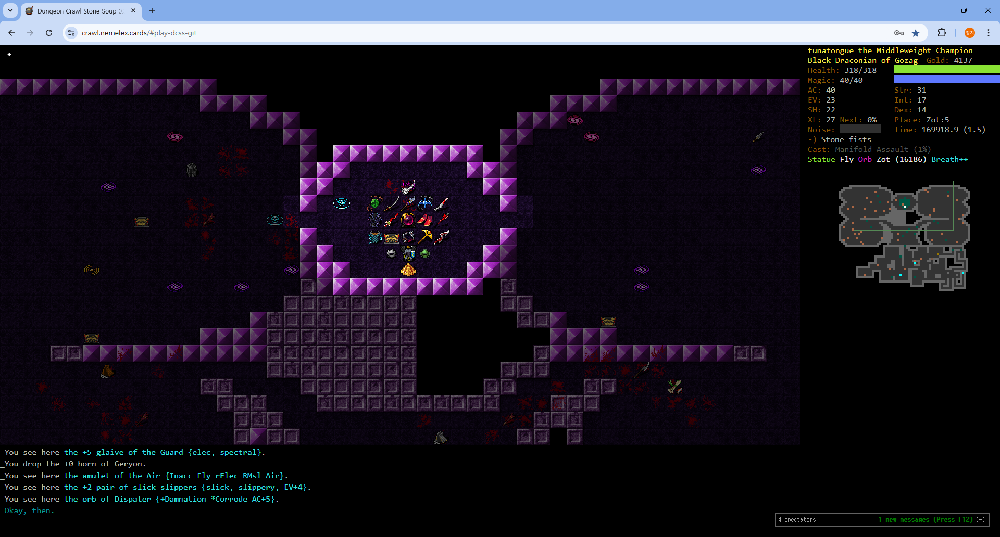

2. WebTiles 팝업 overlay

   중앙 팝업, 배경 dim 처리, 오른쪽 상태 패널과 채팅 박스가 함께 있는 화면입니다.

   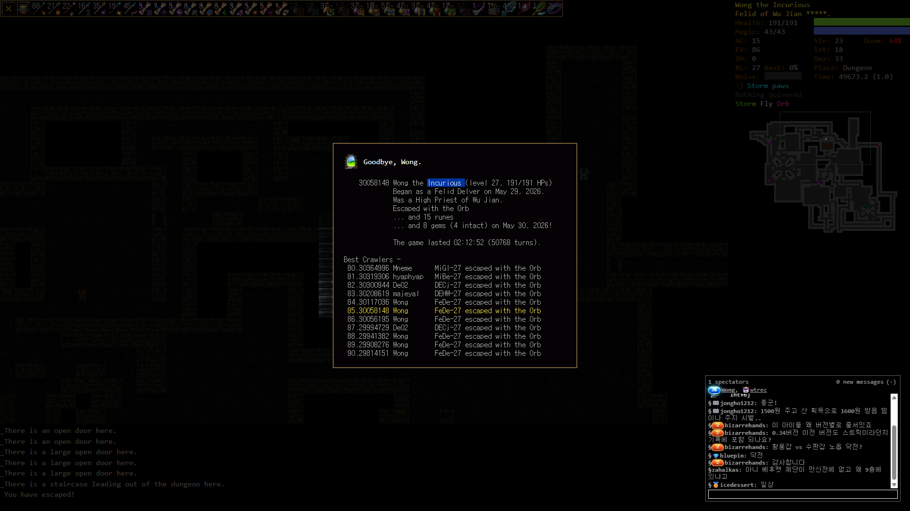

3. WebTiles 지도/상태 crop

   지도, minimap, 오른쪽 상태 텍스트가 보이는 crop입니다.

   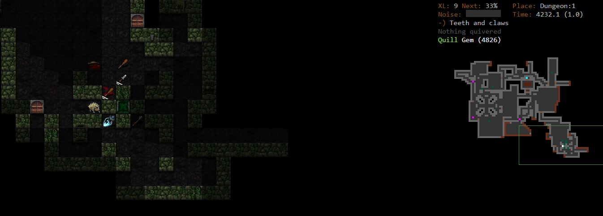

4. 한글판 legacy tiles inventory

   오래된 한글판 화면이지만, 타일 기반 장비/인벤토리/상태 패널 밀도 참고로만 사용합니다.

   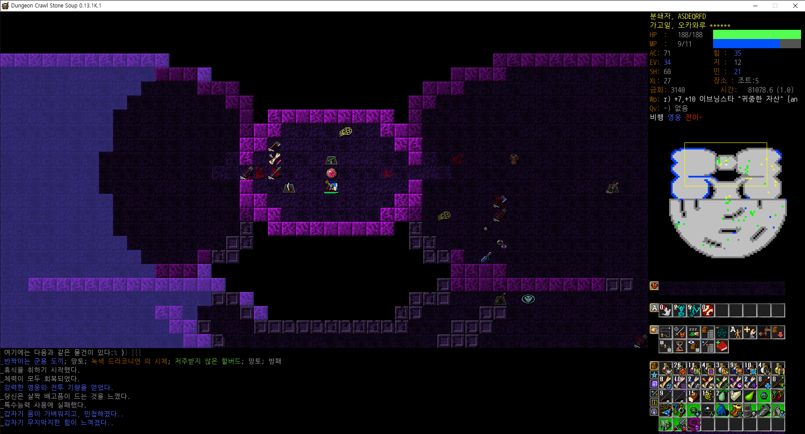

## Source Notes

- `artifact-gloves-description.png`: DCInside 로그라이크 갤러리 `ㄷㅈ)상급장갑`, <https://gall.dcinside.com/board/view/?id=rlike&no=511423&page=1>.
- `mobile-artifact-row.jpg`: DCInside 로그라이크 갤러리 `ㄷㅈ) 그래서 이거 들고 승천하면 되죠?`, <https://gall.dcinside.com/board/view/?id=rlike&no=518762&page=1>.
- `webtiles-current-play-screen.png`: DCInside 로그라이크 갤러리 `ㄷㅈ)검정드라코 쉐슆 올룬클`, <https://gall.dcinside.com/board/view/?id=rlike&no=493572>.
- `armour-description-large.png`: DCInside 로그라이크 갤러리 `ㄷㅈ) 신이름 아티`, <https://gall.dcinside.com/board/view/?id=rlike&no=510916&page=1>.
- `armour-description-equipped.png`: DCInside 로그라이크 갤러리 `ㄷㅈ) 1층 황금용갑옷`, <https://gall.dcinside.com/board/view/?id=rlike&no=515834&page=1>.
- `armour-description-scrollbar.png`: DCInside 로그라이크 갤러리 `ㄷㅈ) 이거 뭔데`, <https://gall.dcinside.com/board/view/?id=rlike&no=508025&page=1>.
- `message-log-artifact-link.png`: DCInside 로그라이크 갤러리 `ㄷㅈ) 변이 선물`, <https://gall.dcinside.com/board/view/?id=rlike&no=507529&page=1>.
- `webtiles-popup-overlay.png` and `webtiles-map-status-crop.png`: DCInside 로그라이크 갤러리 `ㄷㅈ) '시시하군'`, <https://gall.dcinside.com/board/view/?id=rlike&no=518532&page=1>.
- `jewellery-description-korean.png`: DCInside 로그라이크 갤러리 `ㄷㅈ) 장검전사 부문 돌품명품 출품`, <https://gall.dcinside.com/board/view/?id=rlike&no=516900&page=1>.
- `shop-item-list.png`: DCInside 로그라이크 갤러리 `ㄷㅈ)고자그 치곤 좋은거 나온`, <https://gall.dcinside.com/board/view/?id=rlike&no=518324&page=1>.
- `acquirement-item-menu.png`: DCInside 로그라이크 갤러리 `ㄷㅈ) 오카왈도 니뮤ㅠㅠ`, <https://gall.dcinside.com/board/view/?id=rlike&no=518030&page=1>.
- `gloves-description-equipped-short.png` and `gloves-description-short.png`: DCInside 로그라이크 갤러리 `ㄷㅈ) 이끼 미노타 장갑 추천해주세요`, <https://gall.dcinside.com/board/view/?id=rlike&no=517805&page=1>.
- `jewellery-description-english.png`: DCInside 로그라이크 갤러리 `돌죽 아주 조금 안 좋은 불저 냉저 반지`, <https://gall.dcinside.com/board/view/?id=rlike&no=518662&page=1>.
- `equipment-list-mobile.png`: DCInside 로그라이크 갤러리 `ㄷㅈ) 문어 탈리스만 선택존`, <https://gall.dcinside.com/board/view/?id=rlike&no=518522&page=1>.
- `legacy-korean-tiles-inventory.png`: DCInside 로그라이크 갤러리 `ㄷㅈ) 0.13 버전 오랫만에 클리어 해본 후기`, <https://gall.dcinside.com/board/view/?id=rlike&no=389186&page=1>.

## Design Use

- Use `artifact-gloves-description.png`, `armour-description-large.png`, and `jewellery-description-english.png` before changing `DcssItemDescription`.
- Preserve the real DCSS structure: item tile plus title row, black background, monospace body, property explanation rows, acquisition/source lines, search prefix lines, and bottom action row.
- Use list/menu references before changing gallery card density, selected states, or mobile rows.
- Do not use non-DCInside images as frontend design reference in this directory.
